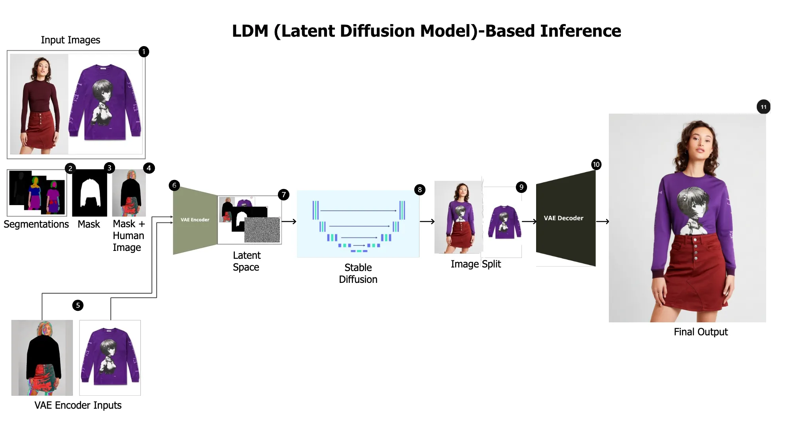

# Virtual Try-On Style Studio

This repository contains a virtual try-on project developed as part of a group learning and research initiative. The code and models provided are intended strictly for educational and experimental use only. **This project is not intended for commercial applications or production environments.**

## Background

Virtual try-on technology is computer vision and deep learning to digitally fit clothing onto images of people. The goal of this project is to explore and experiment with state-of-the-art techniques for human parsing, pose estimation, and image synthesis to enable realistic garment transfer. By combining DensePose, semantic segmentation, and generative models such as Stable Diffusion, this pipeline can map garments onto a target person while preserving body structure and appearance. The project serves as a hands-on platform for understanding and advancing virtual try-on research.

This is an ML-driven data pipeline for virtual try-on.

## Main Pre‑Requisite Libraries

- **Detectron2**: Facebook AI’s detection framework. Backbone for DensePose, providing detection and instance segmentation used in the pose/body‑part pipeline.
- **DensePose**: Dense human pose estimation on top of Detectron2. Maps person pixels to a 3D surface to segment body parts (torso, arms, legs, hands), so we know what to preserve vs. where to place garments.
- **Diffusers (from Hugging Face)**: Stable Diffusion tooling for generation. Uses the stable-diffusion-inpainting model from “booksforcharlie”, including VAE (AutoencoderKL), UNet, and a DDIM‑style scheduler for garment transfer and blending.
- **Transformers (from Hugging Face)**: Model zoo utilities. Provides CLIP image processing/encoding and convenient pre‑trained model loading and feature extraction.
- **Self‑Correction Human Parsing (SCHP)**: Semantic human segmentation (ATR/LIP schemes) to separate clothes, face, hair, accessories, etc., producing precise masks for the try‑on edits.
- **PyTorch**
- **FastAPI**

## Documentation

Project documentation: [https://roksana-mirzaei.github.io/2026/01/23/VirtualTryOn.html](https://roksana-mirzaei.github.io/2026/01/23/VirtualTryOn.html)

## How to Run This Project

* You need an NVIDIA GPU (see requirements in the repo).
* Build and deploy the Docker image, or deploy on Hugging Face Spaces with an NVIDIA machine.

Check out the configuration reference at https://huggingface.co/docs/hub/spaces-config-reference
